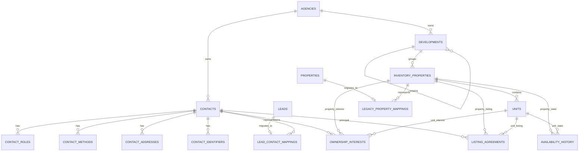

# Aqari ERP Core Real-Estate Domain

## Purpose

This domain separates CRM leads and listing cards from the durable ERP records needed for contacts, ownership, buildings, assets, units, listing agreements, and occupancy history.

The existing `leads` and `properties` tables remain available during the compatibility period. They are migration sources and continue supporting the current UI until the normalized inventory screens are promoted.

## Entity relationship diagram



## Domain rules

### Contacts

- A contact is one person or company record inside one agency.
- Roles are separate rows, allowing one contact to be an owner, buyer, landlord, vendor, and guarantor simultaneously.
- Phones, emails, WhatsApp numbers, addresses, and identifiers are normalized child records.
- Duplicate detection uses normalized phone/email values first, then normalized display name as a lower-confidence candidate.
- Contact deletion is soft deletion. Historical ownership, listing, and contract references remain queryable.

### Developments and inventory

- `developments` is a self-referencing hierarchy with kinds `compound`, `project`, and `building`.
- `inventory_properties` is a durable property/asset record. It may be standalone or belong to a development.
- `units` are independently priced, listed, reserved, sold, rented, or occupied inventory under a property/building.
- The legacy `properties` table remains the CRM listing surface during migration. Each legacy row maps to at most one normalized property.

### Ownership

- Ownership points to exactly one property or one unit.
- Percentages are greater than zero and no more than 100.
- Effective date ranges preserve history; old rows are ended, not overwritten.
- Application services must prevent overlapping active ownership from exceeding 100 percent for the same asset.

### Listings and availability

- Listing agreements point to exactly one property or unit and one principal contact.
- Availability history is append-oriented and records status changes with effective dates.
- Current inventory status is stored on the property/unit for fast querying; history is the authoritative timeline.

## Compatibility migration

The migration is additive and idempotent:

1. Create normalized tables, indexes, validation triggers, and soft-delete protections.
2. Backfill every existing lead into one contact when no mapping exists.
3. Add buyer/prospect roles and normalized phone/email methods from legacy lead data.
4. Backfill every existing legacy property into one normalized inventory property when no mapping exists.
5. Record mappings rather than rewriting legacy primary keys.
6. Continue serving the current CRM routes while normalized APIs and screens are introduced.

No source row is deleted or modified by the backfill.

## Cutover stages

1. **Dual read:** existing UI uses legacy routes; normalized APIs are available for testing and imports.
2. **Dual write:** new contact and inventory screens write normalized records; selected legacy compatibility fields are synchronized where necessary.
3. **Normalized primary:** contracts, finance, maintenance, and documents reference normalized contact/property/unit IDs only.
4. **Legacy retirement:** legacy tables become read-only archive sources after reconciliation and export sign-off.

## Reconciliation checks

Run after every migration:

```sql
SELECT COUNT(*) FROM leads WHERE deleted_at IS NULL;
SELECT COUNT(*) FROM lead_contact_mappings;

SELECT COUNT(*) FROM properties WHERE deleted_at IS NULL;
SELECT COUNT(*) FROM legacy_property_mappings;

SELECT property_id, SUM(ownership_percentage)
FROM ownership_interests
WHERE effective_to IS NULL AND deleted_at IS NULL
GROUP BY property_id
HAVING SUM(ownership_percentage) > 100;

SELECT unit_id, SUM(ownership_percentage)
FROM ownership_interests
WHERE effective_to IS NULL AND deleted_at IS NULL
GROUP BY unit_id
HAVING SUM(ownership_percentage) > 100;
```

Mapping counts may be lower than source counts only when a source row was intentionally archived before migration or a migration error has been recorded and reviewed.

## Rollback

The migration is additive, so application rollback does not require dropping normalized tables. Deploy the prior application version and leave the new tables untouched. Dropping normalized tables is permitted only after a verified backup and only before any contracts, payments, maintenance records, or documents reference normalized IDs.

## Audit and tenant isolation

- Every table includes `agency_id` and tenant-aware indexes.
- API reads and writes always combine record ID with the authenticated agency ID.
- Sensitive changes write to the append-only `audit_logs` table.
- Core business entities use soft deletion and retain historical relationships.
